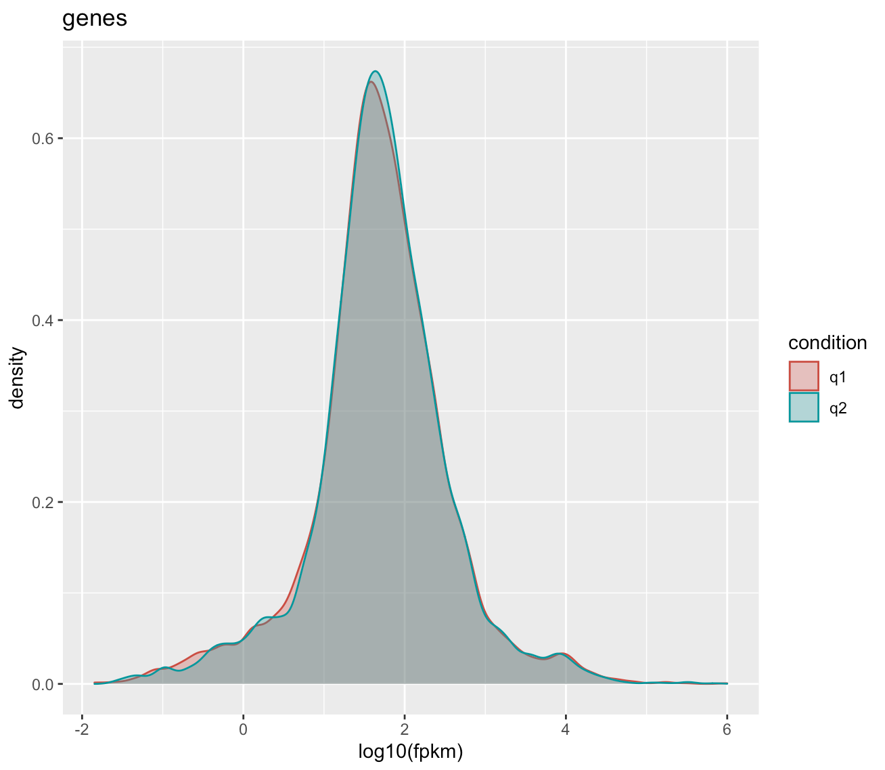
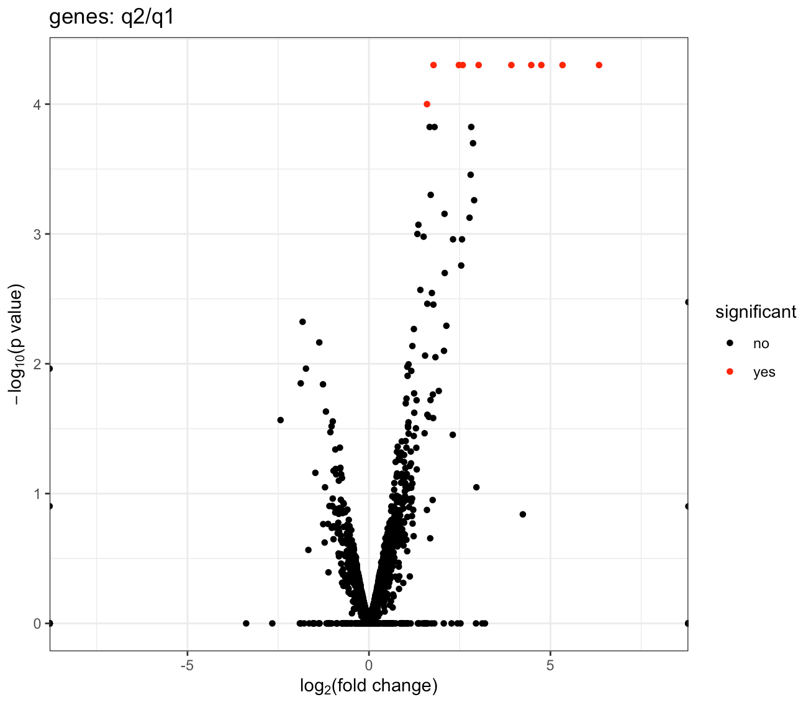
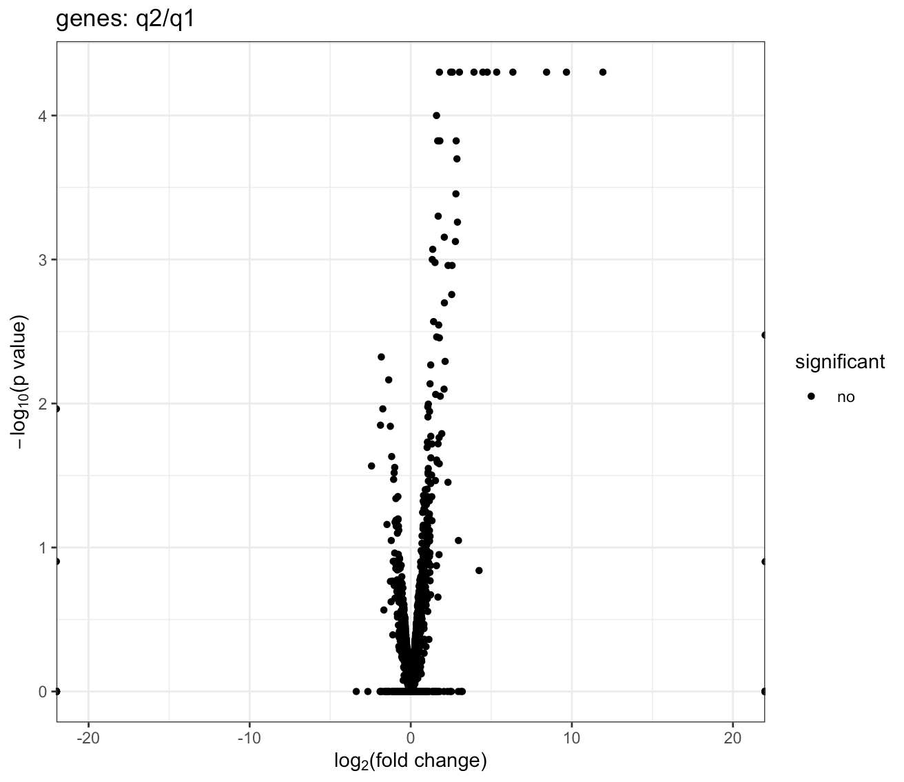
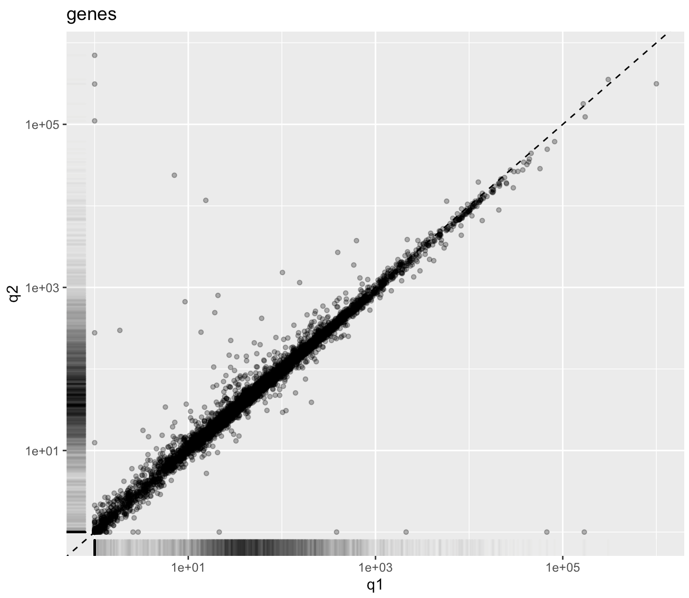
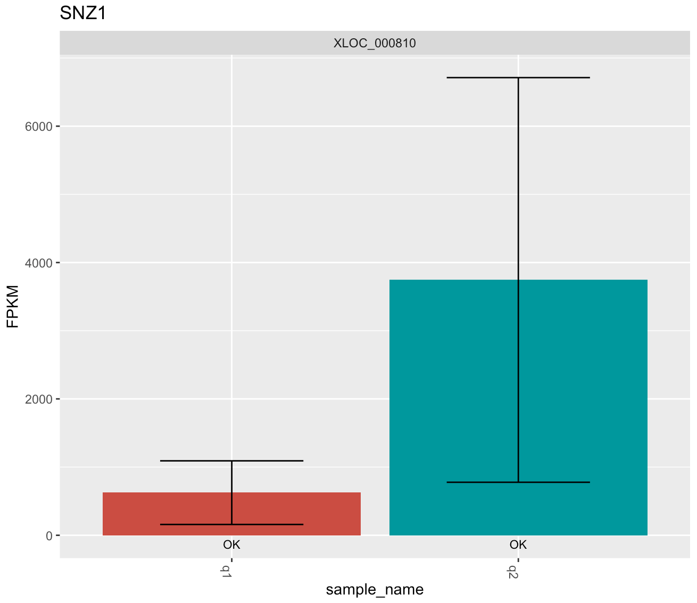

# *C. albicans* RNAseq Workflow Notes 

Name&nbsp;&nbsp;&nbsp;&nbsp;&nbsp;&nbsp;&nbsp;&nbsp;&nbsp;&nbsp;&nbsp;&nbsp;&nbsp;&nbsp;Q Zhang

Course&nbsp;&nbsp;&nbsp;&nbsp;&nbsp;&nbsp;&nbsp;&nbsp;&nbsp;&nbsp;&nbsp;&nbsp;BIOL 379

Instructor&nbsp;&nbsp;&nbsp;&nbsp;&nbsp;&nbsp;&nbsp;&nbsp;Prof. Armbruster

Date&nbsp;&nbsp;&nbsp;&nbsp;&nbsp;&nbsp;&nbsp;&nbsp;&nbsp;&nbsp;&nbsp;&nbsp;&nbsp;&nbsp;&nbsp;&nbsp;2021.10.13-12.16

# Introduction & Background

The Rolfes lab is conducting a study to identify possible genes that regulate thiamine biosynthesis in the yeast *Candida albicans*. *Candida albicans* is a normally commensal species commonly found on humans, but can become pathogenic under certain environmental conditions, leading to the candidiasis disease. By examining the genes that are significantly differentially expressed after removing thiamine from the growing medium, the team hopes to better understand the role of thiamine in the normal growth as well as the pathogenesis of *C. albicans*. 

The Rolfes lab has already sequenced wildtype *Candida albicans* yeast cells grown in two media differing only in thiamine presence — with the control having thiamine (Thi+) and the treatment absent thiamine (Thi-). For each environmental condition, three biological replicates, A, B, and C, were grown and their cellular RNA sequenced via next-gen sequencing techniques. 

The aim of this bioinformatics workflow is to identify *C. albicans* genes that were differentially expressed between Thi+ and Thi- conditions. To do so, we will first clean up the raw sequences, then assemble identified transcripts, and, finally, compare gene expressions between the two treatment conditions across all three replicates. Most of the sequence-processing software programs are a part of the Tuxedo Suite.

## Starting files overview
The two treatment conditions and three biological replicates per condition resulted in six distinct RNA-sequencing samples, each being a paired-end sequencing sample contained in a pair of forward- and reverse-reads FASTQ files. The naming convention to be maintained throughout the workflow is as follows:

The raw RNA-seq files of paired-end sequencing data all derive from the same wildtype (WT) cell line.

| Thiamine+ environment                 | Thiamine- environment                     |
| -----------                           | -----------                               |
| **WTA1**: wildtype, replicate A, Thi+ | **WTA2**: wildtype, replicate A, Thi-     |
| **WTB1**: wildtype, replicate B, Thi+ | **WTB2**: wildtype, replicate B, Thi-     |
| **WTC1**: wildtype, replicate C, Thi+ | **WTC2**: wildtype, replicate C, Thi-     |

## Shell environment
Both the Google Cloud Platform (GCP)'s High-performance cluster (HPC) and the local machine are set to run bash.

[Go to step 1](#step-1---obtain-reads-and-read-counting)

## Menu

[Version log](#version) &nbsp;&nbsp;&nbsp;&nbsp; [Requirements](#requirements-for-this-document)

| Workflow steps         |
| -----------  |
| [Introduction & Background](#introduction--background) |
| [Step 1 - Obtain reads and read counting](#step-1---obtain-reads-and-read-counting) |
| [Step 2 - Clean reads via Trimmomatic](#step-2---clean-reads-via-trimmomatic) |
| [Step 3 - Obtain reference genome](#step-3---obtain-reference-genome) |
| [Step 4 - bowtie2 sequence alignment (mostly for practice)](#step-4---bowtie2-sequence-alignment-mostly-for-practice) |
| [Step 5 - Tophat alignment](#step-5---tophat-alignment) |
| [Step 6 - Transfer to GitHub](#step-6---transfer-to-github) |
| [Step 7 - Infer transcripts using cufflinks](#step-7---infer-transcripts-using-cufflinks) |
| [Step 8 - Merge transcript annotation files using cuffmerge](#step-8---merge-transcript-annotation-files-using-cuffmerge) |
| [Step 9 - Identify differentially expressed genes using cuffdiff](#step-9---identify-differentially-expressed-genes-using-cuffdiff) |
| [Step 10 - Build summary table](#step-10---build-summary-table) |
| [Step 11 - Visualize DE genes using cummeRbund](#step-11---visualize-de-genes-using-cummerbund) |
| [Appendx - All cummeRbund plots](#appendix---all-cummerbund-plots) |
| [Document information](#document-information) |
| [Notebook entry template](#notebook-entry-template) |

---

<br></br>

# Step 1 - Obtain reads and read counting

**Date: 2021.10.13**

[Back to menu](#menu)&nbsp;&nbsp;&nbsp;&nbsp;[Back to intro](#introduction--background)&nbsp;&nbsp;&nbsp;&nbsp;[Next step](#step-2---clean-reads-via-trimmomatic)

## 1A - Objective(s) of this step of the analysis.
The goal in this step is to obtain the raw RNA sequencing reads files (focusing on the WTC2 biological replicate) and count the total number of reads in the forward and reverse FASTQ files before read cleaning in step 2. 

## 1B - Files involved.
As the class used a divide & conquer strategy on these files, I focused on WTC2's paired-end raw data files.
- WTC2_1.fq.gz
    - forward reads of wildtype, Thi-, replicate C.
- WTC2_2.fq.gz
    - reverse reads of wildtype, Thi-, replicate C.


## 1C - Specific commands used in the analysis.
```bash
# obtain the .gz files from Google Bucket
$ gsutil cp gs://gu-biology-dept-class/WTC2*.gz

# unzip the .gz files
$ gunzip *.gz

# count the number of lines in _1.fq & divide by 4
$ wc -l WTC2_1.fq
81630776

$ bc -l <<< '81630776/4'
20407694

# count the number of lines in _2.fq & divide by 4
$ wc -l WTC2_2.fq
81630776

$ bc -l <<< '81630776/4'
20407694
```

## 1D - Results & interpretation.
There are **20,407,694** reads in both the forward and the reverse read files for WTC2. This agreement in read numbers between the forward and reverse read files is expected, since the forward and reverse reads are obtained from the same paired-end sequencing run.

---

<br></br>

# Step 2 - Clean reads via Trimmomatic

**Date: 2021.10.19**

[Back to menu](#menu)&nbsp;&nbsp;&nbsp;&nbsp;[Previous step](#step-1---obtain-reads-and-read-counting)&nbsp;&nbsp;&nbsp;&nbsp;[Next step](#step-3---obtain-reference-genome)

## 2A - Objective(s) of this step of the analysis.
The goal of this step is to use Trimmomatic to trim the raw reads in order to remove the problematic first ten bases of each read, reduce adapter content, improve reverse read quality, and improve read quality scores via sliding window trimming. 

Additionally, the trimmed paired-end reads files will be compared with pre-trim raw reads files using FastQC to ensure that the clean achieved above aims as intended.

## 2B - Files involved.

### —Trimmomatic—
### *input files*
- Raw RNA-seq reads from wildtype, replicate C, thiamine- treatment.
    - WTC2_1.fq.gz
    - WTC2_2.fq.gz

### *output files*
- Paired-end (PE) trimmed sequence files, both forward (_1) and reverse (_2) reads 
    - WTC2_1.trPE.fq.gz
    - WTC2_2.trPE.fq.gz
- Single-end (SE) trimmed sequence files. Note that the forward and reverse reads here are *not* paired.
    - WTC2_1.trSE.fq.gz
    - WTC2_2.trSE.fq.gz
    - We will not use these trimmed single-end reads in subsequent steps.

### —FastQC—
### *input files*
- The raw (pre-trim) paired-end sequence files (see input files in Step 1).
- The trimmed paired-end sequence files.

### *output files*
- FastQC reports (renamed from FastQC default report names)
    - raw_forward_FastQC_report.html
    - raw_reverse_FastQC_report.html
    - trimmed_forward_FastQC_report.html
    - trimmed_reverse_FastQC_report.html

## 2C - Specific commands used in the analysis.
### Create trim.sbatch
```bash
$ nano trim.sbatch
```
- [**trim.sbatch**](scripts/trim.sbatch)

### Run sbatch Trimmomatic command
```bash
$ sbatch trim.sbatch

# to check on sbatch status
$ squeue -u qz108 
# job id was 24813

# wait for sbatch to finish…
# see low long it took
$ sacct -j 24813 --format=Elapsed
39:05
```

### Observe output on Google Cloud Platform 
```bash
# observe output
$ less z01.trim_WTC2
```
- [**z01.trim_WTC2**](slurm_outputs/z01.trim_WTC2)

```bash
# Highlighted output:
Input Read Pairs: 20407694 
Both Surviving: 19459631 (95.35%) 
Forward Only Surviving: 599344 (2.94%) 
Reverse Only Surviving: 218664 (1.07%) 
Dropped: 130055 (0.64%)
# This already gives the answer of 19459631 paired-end reads surviving. Let's check by unzipping.

# copy & store the .gz files in a local folder for later use.
# unzip output files and check number of reads in the trimmed paired-end reads file.
$ gunzip WTC2*trPE*.gz
$ wc -l WTC2_1.trPE.fq
77838524

$ bc -l <<< '/4'
19459631
```

### Observe output on local machine
```bash
# download from GCloud to local directory (with custom alias)
$ get_hpc /home/qz108/RNA_seq_workflow/WTC2*trPE*

# run FastQC command-line version to obtain .html reports 
# for raw reads files
$ fastqc -o raw_forward WTC2_1.fq.gz
$ fastqc -o raw_reverse WTC2_2.fq.gz
```
- [**raw_forward_FastQC_report.html**](summary_outputs/raw_forward_FastQC_report.html)
- [**raw_reverse_FastQC_report.html**](summary_outputs/raw_reverse_FastQC_report.html)
(see rendered reports in Results section)

```bash
# run FastQC command-line version to obtain .html reports 
# for trimmed reads files
$ fastqc -o trimmed_forward WTC2_1.trPE.fq.gz
$ fastqc -o trimmed_reverse WTC2_2.trPE.fq.gz
```

- [**trimmed_forward_FastQC_report.html**](summary_outputs/trimmed_forward_FastQC_report.html)
- [**trimmed_reverse_FastQC_report.html**](summary_outputs/trimmed_reverse_FastQC_report.html)
(see rendered reports in Results section)

The resulting FastQC .html reports were stored in raw_forward/, raw_reverse/, trimmed_forward/, and trimmed_reverse/ folders. The .html reports were uploaded to this notebook.

## 2D - Results & interpretation.

### Interpreting Trimmomatic results.
- [**z01.trim_WTC2**](slurm_outputs/z01.trim_WTC2)
There are 19,459,631 reads in both the forward and reverse trimmed paired-end fastq files.
The read-survival rate is **95.35%.** 

### Links to FastQC reports 
| Forward | Reverse |
| --- | --- |
| [Raw forward reads FastQC report](https://htmlpreview.github.io/?https://github.com/lil-qorgi/379-rnaseq/blob/main/summary_outputs/raw_forward_FastQC_report.html)                        | [Raw reverse reads FastQC report](https://htmlpreview.github.io/?https://github.com/lil-qorgi/379-rnaseq/blob/main/summary_outputs/raw_reverse_FastQC_report.html) |
| [Trimmed forward reads FastQC report](https://htmlpreview.github.io/?https://github.com/lil-qorgi/379-rnaseq/blob/main/summary_outputs/trimmed_forward_FastQC_report.html)    | [Trimmed reverse reads FastQC report](https://htmlpreview.github.io/?https://github.com/lil-qorgi/379-rnaseq/blob/main/summary_outputs/trimmed_reverse_FastQC_report.html) |

### Interpreting FastQC results.
Firstly, comparing *within* the raw or trimmed reads, between forward and reverse reads, the FastQC reports are similar in most metrics. The only difference of note is that reverse reads had slightly more tiles with lower sequence quality than the forward reads. 

Therefore, for the next comparisons, between pre-trim and post-trim reads, we will only compare between the forward reads, as their differences should be representative of the effects of this Trimmomatic run.

In terms of "Per base sequence quality," compared to [raw reads](https://htmlpreview.github.io/?https://github.com/lil-qorgi/379-rnaseq/blob/main/summary_outputs/raw_forward_FastQC_report.html#M1), the [trimmed (forward) reads](https://htmlpreview.github.io/?https://github.com/lil-qorgi/379-rnaseq/blob/main/summary_outputs/trimmed_forward_FastQC_report.html#M1) had *slightly* improved quality scores across all positions in the reads as well as significantly improved quality scores towards the end of the reads (note that the last 10 bp were trimmed from all reads). 

The raw reads were [highly varied in "Per base sequence content" in the first 10 base pairs](https://htmlpreview.github.io/?https://github.com/lil-qorgi/379-rnaseq/blob/main/summary_outputs/raw_forward_FastQC_report.html#M4), which is a pattern commonly seen in NGS data as the machine is still calibrating. This large variation was [largely gone in the trimmed reads](https://htmlpreview.github.io/?https://github.com/lil-qorgi/379-rnaseq/blob/main/summary_outputs/trimmed_forward_FastQC_report.html#M4), since the trimming cropped the first 10 base pairs, which contained the majority of the variation. Still, visible wobbliness remains in the first 3 bases.

As expected, the "Sequence length distribution" had [only one value in the raw reads (150 bp)](https://htmlpreview.github.io/?https://github.com/lil-qorgi/379-rnaseq/blob/main/summary_outputs/raw_forward_FastQC_report.html#M7), but [ranged from 75 to 140 in the trimmed reads](https://htmlpreview.github.io/?https://github.com/lil-qorgi/379-rnaseq/blob/main/summary_outputs/trimmed_forward_FastQC_report.html#M7), with 140 bp being the largest bin. The first 10 bp were trimmed from all raw reads using "HEADCROP:10" in Trimmomatic. Reads shorter than 140 bp were created due to the "SLIDINGWINDOW:4:15" command trimming parts of some reads that had low average quality scores (&lt;15) within 4-bp-wide sliding windows.

"Sequence duplication levels" were largely unchanged between [raw](https://htmlpreview.github.io/?https://github.com/lil-qorgi/379-rnaseq/blob/main/summary_outputs/raw_forward_FastQC_report.html#M8) and [trimmed](https://htmlpreview.github.io/?https://github.com/lil-qorgi/379-rnaseq/blob/main/summary_outputs/trimmed_forward_FastQC_report.html#M8) reads. Although FastQC reports them with warnings, the high sequence duplication levels are fine because the information on read duplication from RNA-seq will become informative in later analyses of gene expression levels.

"Adapter content" [increased towards the end of the reads in the raw reads](https://htmlpreview.github.io/?https://github.com/lil-qorgi/379-rnaseq/blob/main/summary_outputs/raw_forward_FastQC_report.html#M10), while this [adapter contamination was effectively gone in the trimmed reads](https://htmlpreview.github.io/?https://github.com/lil-qorgi/379-rnaseq/blob/main/summary_outputs/trimmed_forward_FastQC_report.html#M10) thanks to the "ILLUMINACLIP" command.

Thus, FastQC has shown that the read cleaning has worked as intended.

All other metrics were largely unchanged between raw and trimmed reads. The full reports are linked to in the preview section above.

---

<br></br>

# Step 3 - Obtain reference genome

**Date: 2021.10.21**

[Back to menu](#menu)&nbsp;&nbsp;&nbsp;&nbsp;[Previous step](#step-2---clean-reads-via-trimmomatic)&nbsp;&nbsp;&nbsp;&nbsp;[Next step](#step-4---bowtie2-sequence-alignment-mostly-for-practice)

## 3A - Objective(s) of this step of the analysis.
The goal of this step is to download the RefSeq *C. albicans* genome assembly from Entrez genome into a separate folder. The reason for downloading this particular assembly is provided in step 4A. 

Species: [Candida albicans SC5314 (budding yeasts)](https://www.ncbi.nlm.nih.gov/Taxonomy/Browser/wwwtax.cgi?mode=Info&id=237561&lvl=3&lin=f&keep=1&srchmode=1&unlock)
Link at Entrez Genome: [GCA_000182965.3](https://www.ncbi.nlm.nih.gov/assembly/GCA_000182965.3)

## 3B - Files involved.
GCF_000182965.3_ASM18296v3_genomic.fna.gz
- The RefSeq genome assembly for *C. albicans*, to be used as reference genome in step 4.

## 3C - Specific commands used in the analysis.
```bash
$ mkdir refseq_GCF_000182965.3
$ cd refseq_GCF_000182965.3
$ wget https://ftp.ncbi.nlm.nih.gov/genomes/all/GCF/000/182/965/GCF_000182965.3_ASM18296v3/GCF_000182965.3_ASM18296v3_genomic.fna.gz
```

## 3D - Results & interpretation.
File obtained: GCF_000182965.3_ASM18296v3_genomic.fna.gz

---

<br></br>

# Step 4 - bowtie2 sequence alignment (mostly for practice)

**Date: 2021.10.26**

[Back to menu](#menu)&nbsp;&nbsp;&nbsp;&nbsp;[Previous step](#step-3---obtain-reference-genome)&nbsp;&nbsp;&nbsp;&nbsp;[Next step](#step-5---tophat-alignment)

## 4A - Objective(s) of this step of the analysis.
The goal in this step is to run bowtie2 (bt2) on the trimmed reads obtained from step 2 to obtain a (non-spliced) alignment to the reference genome for *C. albicans*. The results from this bt2 run will be replaced by the tophat results later on, so this step is mostly to familiarize the student with bowtie2 usage.

We will be using the GCF_000182965.3 assembly as the reference genome for *Candida albicans* to which we align our lab-produced (then trimmed) reads. This assembly was selected out of the [73 available on NCBI Entrez Genome](https://www.ncbi.nlm.nih.gov/genome/browse/#!/eukaryotes/21/) due to its being the only one on RefSeq — a highly curated genomic database (filtering by "RefSeq category" gives only this assembly). Using a RefSeq assembly ensures that the assembly is of high enough quality to be a reference genome against which we can align and then build our transcripts accurately. Additionally, this is a haploid assembly rather than a diploid one, reducing the likelihood that our reads align more than once (which would be much more likely if we tried to align against a diploid assembly).

## 4B - Files involved.
### —bowtie2-build—
### *input files*
- GCF_000182965.3_ASM18296v3_genomic.fna.gz
    - The C. albicans reference genome that will be used.
### *output files*
Index files
- Calbicans.1.bt2
- Calbicans.2.bt2
- Calbicans.3.bt2
- Calbicans.4.bt2
- Calbicans.rev.1.bt2
- Calbicans.rev.2.bt2

### —bowtie2—
### *input files*
Index files
- Calbicans.1.bt2
- Calbicans.2.bt2
- Calbicans.3.bt2
- Calbicans.4.bt2
- Calbicans.rev.1.bt2
- Calbicans.rev.2.bt2
Trimmed FastQ paired-end files (from Trimmomatic) to align
- WTC2_1.trPE.fq
    - forward PE cleaned reads
- WTC2_2.trPE.fq
    - reverse PE cleaned reads
### *output files*
Sequence alignment map
- WTC2.sam

## 4C - Specific commands used in the analysis.
```bash
# Create & navigate to directory
$ mkdir 1021-26_bowtie2_alignment
$ cd 1021-26_bowtie2_alignment
```
### —bowtie2-build—
```bash
# This is to build an index of the reference genome, which is then used by bowtie2 for alignment.

# Enter a compute node
$ srun --pty bash

# Do index run on reference genome
$ bowtie2-build GCF_000182965.3_ASM18296v3_genomic.fna.gz Calbicans
```
### —bowtie2—
```bash
# Copy over the WTC2 trPE fastq files from the outputs of the Trimmomatic run.
$ cp ../1019_Trimmomatic/WTC2*trPE.fq .

# Create sbatch file for bowtie2

$ nano bt2.sbatch
```
- [**bt2.sbatch**](scripts/bt2.sbatch)

```bash
# Run bowtie2 for alignment via slurm script
$ sbatch bt2.sbatch

# Wait for completion...

# Check run stats.
$ 31143 --format=jobid,jobname,account,state,elapsed
# The bowtie2 job took 01:37:18 (1.5+ hours) to complete.

# Check z01 output:
$ less z01.bt2_WTC2
```
- [**z01.bt2_WTC2**](slurm_outputs/z01.bt2_WTC2)

## 4D - Results & interpretation.
The overall alignment rate is 97.97%, which includes both concordant and non-concordant alignments.

90.52% of the input (paired) reads aligned concordantly exactly 1 time (unique concordance rate). Concordance occurs when reads align to the reference genome with both an expected direction and an insert size consistent with the insert size in the RNAseq data. Since this assembly is haploid, this concordance rate is normal, allowing downstream processing to be performed as normal. Since this is also the *unique* concordance rate, we know that more than 90% of the reads can be unequivocably interpreted in the context of the *C. albicans* genome.

[See class's alignment results.](https://docs.google.com/spreadsheets/d/1GZOHIUhfYA523kkOdoF9APQEkRsberddvEsEZOkIIvA/edit)

---

<br></br>

# Step 5 - Tophat alignment

**Date: 2021.10.28**

[Back to menu](#menu)&nbsp;&nbsp;&nbsp;&nbsp;[Previous step](#step-4---bowtie2-sequence-alignment-mostly-for-practice)&nbsp;&nbsp;&nbsp;&nbsp;[Next step](#step-6---transfer-to-github)

## 5A - Objective(s) of this step of the analysis.
Similar to step 4, the goal of this step is to align our trimmed reads from step 2 to a reference genome. This time, we use tophat, which runs bowtie2 under the hood and allows for *spliced* (instead of non-spliced) alignment. Doing a spliced alignment allows us to take into account genes (i.e., their transcripts) that have multiple transcripts due to alternative splicing, which is usually more useful when aligning reads of more complex eukaryotic organisms against their reference genomes.

## 5B - Files involved.
### —Tophat—
### *input files*
Annotation file (unzipped) for identifying splice sites
- GCF_000182965.3_ASM18296v3_genomic.gff

Index files built by bt2
- Calbicans.&lt;x&gt;.bt2 
    - (see previous entry)

Paired-end inputs
- WTC2_1.trPE.fq
- WTC2_2.trPE.fq

### *output files*
Folder containing all outputs
- WTC2_tophat/
    - **accepted_hits.bam**
        - The sequences that were successfully aligned by tophat to the reference genome.
    - **align_summary.txt**
        - A summary of the percentage of input reads that were aligned, either concordantly or discordantly, to the reference genome.
    - deletions.bed  
    - insertions.bed   
    - junctions.bed  
    - logs/
    - prep_reads.info
    - unmapped.bam

**Bolded files** are important.

## 5C - Specific commands used in the analysis.
```bash
$ gunzip GCF_000182965.3_ASM18296v3_genomic.gff.gz

$ nano tophat_align.sbatch
```
- [**tophat_align.sbatch**](scripts/tophat_align.sbatch)

```bash
$ sbatch tophat_align.sbatch
jobid: 37967

# wait for some hours…

$ less z01.tophat_WTC2
# last two lines of z01.tophat_WTC2 are:
```
[2021-10-28 13:03:03] A summary of the alignment counts can be found in WTC2_tophat/align_summary.txt
[2021-10-28 13:03:03] Run complete: 02:52:28 elapsed

```bash
$ cd WTC2_tophat

$ less align_summary.txt
```
- [**align_summary.txt**](summary_outputs/tophat_align_summary.txt)

The reads that were splice-aligned to the reference genome were collected in the accepted_hits.bam file (not included here).

## 5D - Results & interpretation.
Tophat spliced alignment resulted in 90.3% concordant pair alignment rate. Similar to the results in the bowtie2 non-spliced alignment from step 4, this concordance rate is high enough to give us confidence in the results we will obtain after downstream data processing and analyses based on these reads.

[See class's alignment results.](https://docs.google.com/spreadsheets/d/1GZOHIUhfYA523kkOdoF9APQEkRsberddvEsEZOkIIvA/edit)

---

<br></br>

# Step 6 - Transfer to GitHub

**Date: 2021.11.02**

[Back to menu](#menu)&nbsp;&nbsp;&nbsp;&nbsp;[Previous step](#step-5---tophat-alignment)&nbsp;&nbsp;&nbsp;&nbsp;[Next step](#step-7---infer-transcripts-using-cufflinks)

## 6A - Objective(s) of this step of the analysis.
Transfer the journal from Google Docs to GitHub.

## 6B - Files involved.
Repository
- lil-qorgi:379-rnaseq

READ<span>ME.md</span>
- Notes document for RNAseq workflow.

## 6C - Specific commands used in the analysis.

### Create online repository on GitHub.
Create a new repository called "379-rnaseq"

### Cloning online repo to local machine.
The full journal is added to README.md.

```bash
# Create local repo.
# (in parent folder:)
$ git clone https://github.com/lil-qorgi/379-rnaseq.git RNAseq_notes
$ cd RNAseq_notes

# make changes to README.md
# add & commit changes
$ git add .
$ git commit -m "Transferred journal to readme."
$ git push
```

## 6D - Results & interpretation.
The journal has been transferred onto GitHub. All script and output files were extracted into their own folders and linked to from within README.md (this document).

---

<br></br>

# Step 7 - Infer transcripts using cufflinks

**Date: 2021.11.04**

[Back to menu](#menu)&nbsp;&nbsp;&nbsp;&nbsp;[Previous step](#step-6---transfer-to-github)&nbsp;&nbsp;&nbsp;&nbsp;[Next step](#step-8---merge-transcript-annotation-files-using-cuffmerge)

## 7A - Objective(s) of this step of the analysis.
The goal of this step is to use cufflinks, taking in the tophat read alignment results from step 5, to infer the gene transcripts that are found in the RNA-seq samples, focusing on the sample we began with, which is WTC2 (wildtype, replicate C, thiamine-). 

See [cufflinks manual](http://cole-trapnell-lab.github.io/cufflinks/manual/).

## 7B - Files involved.
### —cufflinks—

### *input files*
- GCF_000182965.3_ASM18296v3_genomic.gff
    - The reference genome annotation file
        - Note that, even though cufflinks manual says it requires .gtf., .gff works for cufflinks as well because the two file formats are very similar.
- accepted_hits.bam
    - The sequences that were successfully aligned by tophat to the reference genome from the previous step.
### *output files*
- cufflinks_output/
    - genes.fpkm_tracking
    - isoforms.fpkm_tracking
    - skipped.gtf
    - **transcripts.gtf**
        - this is the annotations file containing the transcripts inferred from the accepted_hits.bam alignment file.

## 7C - Specific commands used in the analysis.
```bash
# First, pull all required files together into the same folder for easier usage.

# Then write the slurm script for cufflinks
$ nano cufflinks.sbatch
```
- [**cufflinks.sbatch**](scripts/cufflinks.sbatch)

```bash
# Run the sbatch script
$ sbatch cufflinks.sbatch

$ squeue -u qz108

# Wait for job to complete.

$ sacct -j 44135 --format=jobid,jobname,account,state,elapsed
# The job took 05:48 minutes to complete.

# See the sbatch output
$ less z01.cufflinks_WTC2
```
- [**z01.cufflinks_WTC2**](slurm_outputs/z01.cufflinks_WTC2)

```bash
# One of the last lines says:
Processed 6131 loci.

$ cd cufflinks_output/
$ ls -l

-rw-r--r-- 1 qz108 users  739513 Nov  2 19:59 genes.fpkm_tracking
-rw-r--r-- 1 qz108 users  756069 Nov  2 19:59 isoforms.fpkm_tracking
-rw-r--r-- 1 qz108 users       0 Nov  2 19:55 skipped.gtf
-rw-r--r-- 1 qz108 users 2958558 Nov  2 19:59 transcripts.gtf

$ wc -l transcripts.gtf
# There are 12994 lines in the file. There is no header in the file.

$ less transcripts.gtf
# The file looks good.

# show the first line of the transcripts file
$ head -1 transcripts.gtf
NC_032089.1	Cufflinks	transcript	4409	4720	1000	-	.	gene_id "gene-CAALFM_C100020CA"; transcript_id "rna-XM_713980.1"; FPKM "521.8005143954"; frac "1.000000"; conf_lo "476.336034"; conf_hi "567.264995"; cov "2354.204503";

```

## 7D - Results & interpretation.
The cufflinks program successfully inferred transcripts based on the tophat alignment results and placed the transcripts into an annotation file called transcripts.gtf.

---

<br></br>

# Step 8 - Merge transcript annotation files using cuffmerge

**Date: 2021.11.09**

[Back to menu](#menu)&nbsp;&nbsp;&nbsp;&nbsp;[Previous step](#step-7---infer-transcripts-using-cufflinks)&nbsp;&nbsp;&nbsp;&nbsp;[Next step](#step-9---identify-differentially-expressed-genes-using-cuffdiff)

## 8A - Objective(s) of this step of the analysis.
The goal in this step is to merge the transcript annotation files from all biological replicates to obtain the merged annotation file, merged.gtf.

The six transcript files being merged came from performing steps 2, 5, and 7 on all of the six sets of raw RNA-seq sample data (WTA1, A2, B1, B2, C1, C2).  

## 8B - Files involved.
### —cuffmerge—
### *input files*
- GCF_000182965.3_ASM18296v3_genomic.gff
    - Note that, similar to cufflinks, even though cuffmerge  requires .gtf., .gff works as well because the two file formats are very similar.
- transcript gtf's, resulting from running previous steps from Trimmomatic to tophat (not including bowtie2) over each original raw reads file from the sequencing run.
    - WTA1_transcripts.gtf
    - WTA2_transcripts.gtf
    - WTB1_transcripts.gtf
    - WTB2_transcripts.gtf
    - WTC1_transcripts.gtf
    - WTC2_transcripts.gtf
- file specifying the transcript gtfs
    - transcripts_gtf.txt
        ```
        WTA1_transcripts.gtf
        WTA2_transcripts.gtf
        WTB1_transcripts.gtf
        WTB2_transcripts.gtf
        WTC1_transcripts.gtf
        WTC2_transcripts.gtf
        ```

### *output files*
- cuffmerge_output/
    - logs/
        - run.log
    - **merged.gtf**
        - this is the annotation file that merges the transcripts.gtf file from the previous (cufflinks) step obtained for all biological replicates and experimental conditions: WTA1, A2, B1, B2, C1, C2. 

## 8C - Specific commands used in the analysis.
```bash
# First, move all required input files into the same folder.
# Obtain all transcripts.gtf files from Google Bucket:
$ gsutil cp gs://gu-biology-dept-class/*.gtf 

# Create a text file specifying the transcript.gtf files
$ nano transcripts_gtf.txt
```
```
WTA1_transcripts.gtf
WTA2_transcripts.gtf
WTB1_transcripts.gtf
WTB2_transcripts.gtf
WTC1_transcripts.gtf
WTC2_transcripts.gtf
```
```bash
# Create an sbatch file for cuffmerge.
$ nano cuffmerge.sbatch
```
- [**cuffmerge.sbatch**](scripts/cuffmerge.sbatch)

```bash
# check folder contents
$ ls -1
cuffmerge.sbatch
GCF_000182965.3_ASM18296v3_genomic.gff
transcripts_gtf.txt
WTA1_transcripts.gtf
WTA2_transcripts.gtf
WTB1_transcripts.gtf
WTB2_transcripts.gtf
WTC1_transcripts.gtf
WTC2_transcripts.gtf

# run sbatch script
sbatch cuffmerge.sbatch

# wait for sbatch script to finish

# check the sbatch output file
$ less z01.cuffmerge
```
- [**z01.cuffmerge**](slurm_outputs/z01.cuffmerge)

```bash
# go to cuffmerge_output
$ cd cuffmerge_output

# check contents
$ ll
drwxr-xr-x 2 qz108 users       0 Nov  4 10:34 logs
-rw-r--r-- 1 qz108 users 1577746 Nov  4 10:35 merged.gtf

# check job elapsed time
$ sacct -j 47686 --format=jobname,jobid,user,elapsed
# the process took 35 seconds.
```

## 8D - Results & interpretation.
Cuffmerge successfully merged the six transcript annotation (.gtf) files and produced the merged.gtf file. This merged.gtf file contains all of the gene transcripts that could be identified based on the RNA-seq data of the wildtype *C. albicans* samples collected in this experiment. 

merged.gtf serves as the overall set of transcripts from which the transcripts (genes) that were significantly differentially expressed between the control (Thi+) and the treatment (Thi-) will be identified in the next step.

---

<br></br>

# Step 9 - Identify differentially expressed genes using cuffdiff

**Date: 2021.11.11**

[Back to menu](#menu)&nbsp;&nbsp;&nbsp;&nbsp;[Previous step](#step-8---merge-transcript-annotation-files-using-cuffmerge)&nbsp;&nbsp;&nbsp;&nbsp;[Next step](#step-10---build-summary-table)

## 9A - Objective(s) of this step of the analysis.
The goal in this step is to identify the genes (i.e., their transcripts) that were significantly differentially expressed between the control (Thi+) and treatment (Thi-) groups. The replicates from the control and from the treatment will be pooled into two groups and compared against each other in a single step using the cuffdiff program. In other words, the gene expression levels in the set {A1, B1, C1} (Thi+) will be compared with those in the set {A2, B2, C2} (Thi-).

## 9B - Files involved.
### —cuffdiff—
### *input files*
All input files for cuffdiff are placed into a new folder named "cuffdiff_input"
- cuffdiff_input/
    - **merged.gtf**
        - the feature annotation file from the previous step that merged all biological replicates (A1 through C2) via cuffmerge.
    - &ast;*The following files are the  accepted hits for all replicates under Thi+ and Thi- treatments*:
        - **WTA1_accepted_hits.bam**
        - **WTB1_accepted_hits.bam**
        - **WTC1_accepted_hits.bam**
        - **WTA2_accepted_hits.bam**
        - **WTB2_accepted_hits.bam**
        - **WTC2_accepted_hits.bam**
        - these accepted hits .bam files were obtained from tophat alignment over Trimmomatic-cleaned RNAseq data for each of the samples. In other words, we repeated the previous analysis steps from the first step (2021.10.13) through to the tophat alignment step (2021.10.28) for each raw sequence reads file (excluding the bowtie2 step, which was for practice). The links below reference those steps.
            1. [Obtain the reference genome](#step-3---obtain-reference-genome) for *Candida albicans*. It only needs to be obtained once.
            1. [Obtain the raw RNA-seq paired-end fastq files](#step-1---obtain-reads-and-read-counting) for the biological replicate (e.g. WTB1)
            1. Clean the reads via [Trimmomatic]((#step-2---clean-reads-via-trimmomatic))
            1. Run the paired-end reads against the reference genome using the [Tophat spliced alignment program](#step-5---tophat-alignment) to obtain accepted_hits.bam for the replicate. 
                - After obtaining the file, prepend accepted_hits.bam with the replicate name (e.g. WTB1_accepted_hits.bam), then copy the file into cuffdiff_input/

### *output files*
All output files will be exported into "cuffdiff_output" as specified by the cuffdiff call (see sbatch). 
- cuffdiff_output/
    - **gene_exp.diff**
    - ... (many other cuffdiff results)
- [**z01.cuffdiff**](slurm_outputs/z01.cuffdiff)

## 9C - Specific commands used in the analysis.
```bash
$ mkdir cuffdiff_input
# copy merged.gtf and all of the <sample>.bam files into cuffdiff_input/

# edit cuffdiff.sbatch
$ nano cuffdiff.sbatch
```
[cuffdiff.sbatch](scripts/cuffdiff.sbatch)

```bash
# run sbatch script. Note that cuffdiff_inputs/ is parallel to cuffdiff.sbatch
$ sbatch cuffdiff.sbatch

# wait for job to finish...

# check job status
$ sacct -j <jobid> --format=jobid,jobname,account,state,elapsed

# it took 01:20:09 (~80 minutes) for the job to finish.

# observe the slurm output 
$ less z01.cuffdiff
```
[**z01.cuffdiff**](slurm_outputs/z01.cuffdiff)

```bash
# first change into the output folder, then check the output files
$ cd cuffdiff_output

$ ls -1
bias_params.info
cds.count_tracking
cds.diff
cds_exp.diff
cds.fpkm_tracking
cds.read_group_tracking
gene_exp.diff
genes.count_tracking
genes.fpkm_tracking
genes.read_group_tracking
isoform_exp.diff
isoforms.count_tracking
isoforms.fpkm_tracking
isoforms.read_group_tracking
promoters.diff
read_groups.info
run.info
splicing.diff
tss_group_exp.diff
tss_groups.count_tracking
tss_groups.fpkm_tracking
tss_groups.read_group_tracking
var_model.info

# check whether the gene_exp.diff file was properly generated 
$ less gene_exp.diff

$ head -2 gene_exp.diff
test_id	gene_id	gene	locus	sample_1	sample_2	status	value_1	value_2	log2(fold_change)	test_stat	p_value	q_value	significant
XLOC_000001	XLOC_000001	CTA2	NC_032089.1:10717-11485	q1	q2	OK	115.839	102.977	-0.169788	-0.2598790.6459	0.99995	no
# the file appears to have 14 tab-delimited columns and the corresponding contents. This file appears to be properly generated.

$ wc -l gene_exp.diff
# there are 6239 lines. So, subtracting line 1 as header, there are 6238 observations.
```

## 9D - Results & interpretation.
The cuffdiff differential expression analysis was successful. 

We were able to calculate the log fold change, p-value, q-value (p-value adjusted by false discovery rate), and significance of differential expression between genes from the Thiamine+ group (column q1) and genes from the Thiamine- group (column q2). 

In the gene_exp.diff:
- The test_id is the internal label given to a particular transcript within this particular Tuxedo Suite run (starting at cuffmerge step).
- The gene_id is the NCBI locus ID.
- The FPKM (fragments per kilobase of transcript per million mapped reads) values, representing normalized gene expression levels, for q1 and q2 are value_1 and value_2, respectively. 
- The log2(fold_change) is calculated as log-base-2 of (value_2/value_1). 
- The 'significant' column indicates whether the q-value of a column is less than 0.05.

Now that we have the differential expression results from the experiment stored in gene_diff.exp, we can move on to building the RNAseq summary table of differentially expressed genes. 

---

<br></br>

# Step 10 - Build summary table

**Date: 2021.11.16**

[Back to menu](#menu)&nbsp;&nbsp;&nbsp;&nbsp;[Previous step](#step-9---identify-differentially-expressed-genes-using-cuffdiff)&nbsp;&nbsp;&nbsp;&nbsp;[Next step](#step-11---visualize-de-genes-using-cummerbund)

## 10A - Objective(s) of this step of the analysis.
Using the results stored in gene_exp.diff from the previous step as well as two online resources, Uniprot and Entrez Nucleotide (for protein functional annotation), we will build a summary table of the genes that were (statistically) significantly differentially expressed in the absence of thiamine (Thi-; treatment) versus in the presence of thiamine (Thi+; control).

Our method is to join two sub-tables, derived from merged.gtf and gene_exp.diff, along the Tuxedo Suite ID field that they share. We will build a table that contains differentially expressed (**DE**) genes along with their FPKMs, log2 fold changes, and q-values (from gene_exp.diff) along with their NCBI protein IDs (from merged.gtf) and known descriptions of their functions (from Uniprot and Entrez Nucleotide).

## 10B - Files involved.
### Files to build sub-tables
**gene_exp.diff**

**merged.gtf**

### DE genes summary table
**DE_genes_summary_table.xlsx**

## 10C - Specific commands used in the analysis.
Columns we'll need in our summary table:
- TUXEDO SUITE ID
- NCBI ID (taken from merged.gtf)
- GENE LABEL (acronym)
- FPKM_THI+
- FPKM_THI-
- LOG2_FC (THI- relative THI+)
- Q-VALUE (FDR CORRECTED)
- NOTES INTERPRETATION (from uniport and entrez nucleotide)

On the HPC cloud node, we'll copy merged.gtf and gene_exp.diff into a separate folder. (In this case, I named that folder 1116_cuffdiff_results_interpretation/)

### extract data from gene_exp.diff to obtain genes and expression levels.
We'll first obtain the columns we want from gene_exp.diff

```bash
# The columns that we need from gene_exp.diff are: 1, 3, 8, 9, 10, 13
$ grep "yes" gene_exp.diff | cut -f1,3,8-10,13 > DE_genes.txt
```

### extract data from merged.gtf to find NCBI IDs.
We'll next obtain the NCBI IDs by grepping the XLOC IDs from gene_exp.diff against merged.gtf.

```bash
# We first extract only the XLOC ID column from the "yes," i.e., differentially expressed, genes. This is similar to the previous command, but includes only the XLOC ID column.
$ grep "yes" gene_exp.diff | cut -f1 > signif_xlocIDs

# We grep these significantly regulated xlocIDs (signif_xlocIDs) against merged.gtf to obtain the corresponding transcripts and their NCBI IDs.
$ grep -wFf signif_xlocIDs merged.gtf > results_summary

# From results_summary, we extract the columns representing xlocIDs, gene names, and NCBI IDs. The gene name column is used for double-checking whether it lines up with the gene names from DE_genes.txt extracted from gene_exp.diff earlier.
$ cut -f9 results_summary | cut -d " " -f2,8,10 > NCBI_IDs.txt
```

### Join the two sub-tables.

Now that we have both the file containing gene_exp.diff's relevant columns and the file containing their corresponding NCBI IDs from merged.gtf, we'll first download them to the local machine.

```bash
# The following commands are run on local, inside my RNA-seq local folder.

# Use gcloud compute scp to copy DE_genes.txt and NCBI_IDs.txt to a new subfolder.
$ gcloud compute scp cherries-controller:<path to DE_genes.txt> .
$ gcloud compute scp cherries-controller:<path to NCBI_IDs.txt> .
```
#### Import data
- Create an Excel spreadsheet called "Join subtables.xlsx"
- Inside this Excel file, create two empty sheets called "DE_genes" and "NCBI_IDs". 
- Import DE_genes.txt and NCBI_IDs.txt into corresponding sheets.
- Sort both sheets by their field of commonality, which is the XLOC ID column. 

#### Correspondence check
- Next, create a new sheet called "Correspondence check" and copy both sheets' data side-by-side into this sheet.
- In a new column, use the formula "=IF(cellA=cellB,"Match","Nomatch")" where cell A is an XLOC ID from DE_genes and cell B is the corresponding XLOC ID from merged.gtf. 
- Extend this formula to the last observation. Check that all cells in this column say "Match"
- Create a new sheet called "Joined"
- Combine the two sub-tables from "Correspondence check" into one, eliminating duplicate columns. 

### Complete the summary table with UniProt and Entrez Nucleotide descriptions
- Duplicate Excel file, naming the new file "DE_genes_summary_table", and keep only the "Joined" sheet.
- Add new columns:
    - gene_interpretation_uniprot
    - gene_interpretation_entrez_nucleotide
    - uniprot_link-
    - entrez_nucleotide_link"
- Perform UniProt and Entrez Nucleotide searches using the NCBI IDs and fill in the corresponding cells for the four new columns.

## 10D - Results & interpretation.
Using the gene_exp.diff results from step 9 and their corresponding NCBI IDs from merged.gtf, we built a summary table of the genes (statistically significantly) differentially expressed between the Thi+ and Thi- treatments.

[The Excel table is here](final_results/DE_genes_summary_table.xlsx).
For online viewing, here is also a [csv version](final_results/DE_genes_summary_table.csv).


---

<br></br>

# Step 11 - Visualize DE genes using cummeRbund

**Date: 2021.11.18**

[Back to menu](#menu)&nbsp;&nbsp;&nbsp;&nbsp;[Previous step](#step-10---build-summary-table)&nbsp;&nbsp;&nbsp;&nbsp;[Next section](#appendix---all-cummerbund-plots)

## 11A - Objective(s) of this step of the analysis.
The goal of this step is to use multiple plot types to visualize the gene expressions of the DE genes identified in step 9 by cuffdiff and summarized in step 10 in DE_genes_summary_table.csv. 

We will create 5 plots using the R package cummeRbund and focus on two of them to analyze.

## 11B - Files involved.
### —Data visualization—
### *R script*
[cummeRbund.R](scripts/cummeRbund.R)

### *underlying data*
cuffdiff_output/
- The full cuffdiff_output/ folder that was the output of the cuffdiff run from step 9.


## 11C - Specific commands used in the analysis.

On local terminal: download cuffdiff_output/ folder from HPC to local machine. 
```bash
$ gcloud compute scp --recurse cherries-controller:<path to cuffdiff_output> .
```

[See the R script](scripts/cummeRbund.R) for which commands create which plots.

## 11D - Results & interpretation.

Using cummeRbund visualization of the data sets from both Thiamine+ and Thiamine- conditions, we can now perform exploratory data analysis. We focus on two of the five figures generated by the cummeRbund script for results and discussion. 

### Comparing overall gene expression levels between treatments

Figure 1 **compares the gene expression levels** between the **overall**sets of genes observed **from the two treatments**. (It **does not provide information** regarding individual genes.)

We begin by observing that this is a density plot containing **two** gene expression level **distributions**, one for each treatment in this study. 

Figure 1 contains density plots for the FPKM values, which are normalized metrics for gene expression levels, for both Thiamine+ (q1) and Thiamine- (q2) transcripts.

The log10(fpkm) value on the x-axis represents the **log-transformed value** of the **FPKM values**, which are **normalized numerical measures of gene expression levels**. On the y-axis we have **densit**y, which represents **the proportion** of the total number of observed gene transcripts that have a **given log10(fpkm) value**, which is on the x-axis. A **majority** of the gene expression levels fall between **10^0 and 10^4 FPKM**, for both conditions.

But more importantly, we look at the **amount of overlap** between the two density curves for the gene expression levels of the two conditions. The fact that q1 and q2 (the two treatments) have **highly overlapping** curves suggests that the expression level of the overall set of genes **did not change significantly** between treatments. If **q2 were to** have higher overall gene expression level, we would have seen that in the form of a **rightward shift** in the blue, q2, curve. In that hypothetical scenario, the results **would suggest** that the effect of removing Thiamine from growing media **resulted in an overall increase** in gene expression level for cells grown in such an environment. **However,** we do not see that. The high degree of similarity between the curves instead suggests that the absence of Thiamine in the growing media **did not lead to an increase** of overall gene expression level in the Thiamine- condition.

Finally, this density plot cannot inform us as to whether particular, individual genes were over- or under-expressed from q1 to q2. Such results would have to be observed in other data representations.


Fig. stuff
Specifically, **q1 is the Thiamine+ treatment while q2 is the Thiamine- treatment**.




**Figure 1. Density plots of FPKM values for Thiamine+ (q1) and Thiamine- (q2) *Candida albicans* gene transcripts.**
 
<br></br>
 
### Visualizing genes' significance versus fold change between treatments

Figure 2 is a volcano plot of the fold change value for all of the genes, with the fold change value calculated as the expression level of each gene under Thiamine- condition over the corresponding expression level under Thiamine+ condition. The x-axis represents the log base 2 transformed value of the fold change, as calculated by dividing q2 FPKM by q1 FPKM. The y-axis represents the negative of the log base 10 transformed value of the significance indicator, p-value, calculated from step 9 in cuffdiff. Genes with significance above the threshold 0.05 are colored red. The significance threshold is set at an alpha value of 0.05. 

This plot compares the significance of gene expression change with the fold change between the two treatments. 

The cummeRbund manual is linked here [](http://compbio.mit.edu/cummeRbund/manual_2_0.html).

This plot is relatively straightforward to interpret. The red dots are the significant genes. Because the red dots are all to the right of 0 on the log2(fold change) scale, all of the significantly regulated genes are significantly *up*regulated in the Thiamine- condition when compared with the Thiamine+ condition. The dots on the horizontal line of -log10(pvalue) of 0 represent genes that were not observed to change significantly between conditions. There are also a few dots to the very edges of either side of the plot. These genes are possibly the ones that have no expression under one condition and at least some expression under the other. 

Figure 2 is a scatter plot of the FPKM values (gene expression levels) between genes treated under Thiamine+ versus genes under Thiamine- conditions.



**Figure 2. Volcano plot of *Candida albicans* genes plotted on -log10(p value) versus log2(fold change) scale.** Red color highlights genes with significant differential expression between Thiamine+ and Thiamine- treatments.

<br></br>

---


## Appendix - All cummeRbund plots

[Back to menu](#menu)&nbsp;&nbsp;&nbsp;&nbsp;[Previous section](#step-11---visualize-de-genes-using-cummerbund)&nbsp;&nbsp;&nbsp;&nbsp;[Next section](#document-information)

This appendix contains all five plots produced by the cummeRbund.R script. The figures are arranged in order of their creation in the script.


**Figure A. Density plots of FPKM values for Thiamine+ (q1) and Thiamine- (q2) *Candida albicans* gene transcripts.** This figure is equivalent to Figure 1 found in section 11D in the main body of this notebook.
 
<br></br>



**Figure B. Simple volcano plot of *Candida albicans* genes plotted on -log10(p value) versus log2(fold change) scale.** 

<br></br>


**Figure C. Volcano plot of *Candida albicans* genes plotted on -log10(p value) versus log2(fold change) scale.** The red color highlights genes with significant differential expression between Thiamine+ and Thiamine- treatments. This figure is equivalent to Figure 2 found in section 11D in the main body of this notebook.

<br></br>




**Figure D. Log-scale scatter plot of FPKM values for *Candida albicans* genes under Thiamine- (q2) versus under Thiamine+ (q1) treatment.**

<br></br>




**Figure E. Bar plot of a *Candida albicans* gene, SNZ1, shows significantly higher gene expression (FPKM) levels under Thiamine- (q2) compared with Thiamine+ (q1) condition.**

---

# Document information

[Back to menu](#menu)&nbsp;&nbsp;&nbsp;&nbsp;[Previous section](#appendix---all-cummerbund-plots)&nbsp;&nbsp;&nbsp;&nbsp;[Next section](#notebook-entry-template)
    
## Version
    
v0.1.0&nbsp;&nbsp;&nbsp;&nbsp;&nbsp;&nbsp;&nbsp;&nbsp;2021.10.12
- Entries logged using Google Docs.

v1.0.0&nbsp;&nbsp;&nbsp;&nbsp;&nbsp;&nbsp;&nbsp;&nbsp;2021.11.02
- Entries transferred to and logged using GitHub.
- Repo: lil-qorgi:379-rnaseq

v1.1.0&nbsp;&nbsp;&nbsp;&nbsp;&nbsp;&nbsp;&nbsp;&nbsp;2021.12.11
- All contents added.
    
v1.2.0&nbsp;&nbsp;&nbsp;&nbsp;&nbsp;&nbsp;&nbsp;&nbsp;2021.12.11(?)
- Revised.

## Requirements for this document
(notes to self)
- Document everything that one would need to follow to recapitulate your analysis. Include: 
    - Explanations for all input & output file names.
    - All commands / steps for downloading files, running software & scripts, performing analyses, etc.
    - [See example notebook (private link)](https://docs.google.com/document/d/1KJAZZpvzMqlzfekco8q_vjajGqBRnzcg/edit)


<br></br>

# Notebook entry template

[Back to menu](#menu)&nbsp;&nbsp;&nbsp;&nbsp;[Previous section](#document-information)

<copy-from-here>

<br></br>

# Step n - Title

**Date: yyyy.mm.dd**

[Back to menu](#menu)&nbsp;&nbsp;&nbsp;&nbsp;[Previous step]()&nbsp;&nbsp;&nbsp;&nbsp;[Next step]()

## nA - Objective(s) of this step of the analysis.

## nB - Files involved.

## nC - Specific commands used in the analysis.
```bash
```

## nD - Results & interpretation.

---

<copy-to-here>

